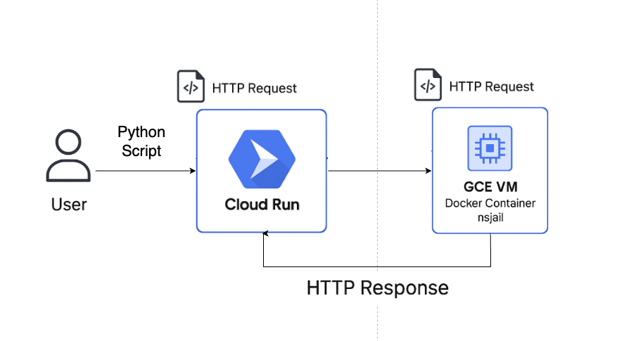

## StackSync Python Script Executor API (https://script-proxy-646785417397.us-central1.run.app/execute)
A secure, Flask-based API that executes user-submitted Python scripts inside an isolated sandbox using nsjail, built for safe and controlled execution.
Only the result of the script’s main() function is returned — ensuring security, performance, and simplicity.

## Flow Diagram


## Why not run nsjail in Cloud Run?
Google Cloud Run does not support privileged containers or low-level Linux capabilities (like namespace isolation, chroot, and mounting), which are required for nsjail to function properly. To maintain strong sandboxing and security guarantees, nsjail is instead run on a GCE Virtual Machine with full control over the execution environment.

## 🚀 Example Usage
```bash
curl -X POST https://script-proxy-646785417397.us-central1.run.app/execute -H "Content-type: application/json" -d'{"script": "def main():\n print(\"Hello World\")\n print(\"Hello StackSync\")\n return {\"message\": \"I would love to contribute to your team! saarthakmudigere@gmail.com\"}"}'
```

**Expected Response**
```bash
{"result":{"message":"I would love to contribute to your team! saarthakmudigere@gmail.com"},"stdout":["Hello World","Hello StackSync"]}
```

## 🐳 Local Development
1. Navigate to stacksync-script-executor
2. Build the Docker Image
```bash
docker build --no-cache -t script-executor .
```
3. Run the Container
```bash
docker run --privileged -d -p 8080:8080 --name script-executor script-executor
```

## ⚡ Features  
- **Lightweight Docker image**, suitable for serverless platforms
- **Rejects scripts without a main() function**  
- **Runs in a secure, isolated environment** using nsjail
- **Supports common libraries** like pandas, numpy, and os
- **Executes Python scripts** via /execute endpoint

## Tech Stack
- Python 3.11
- Flask (for REST API)
- nsjail (for script isolation)
- Docker (containerized deployment)
- Google Cloud Run (serverless hosting)

## Support the Project
If you like this project, give it a star ⭐ on GitHub!